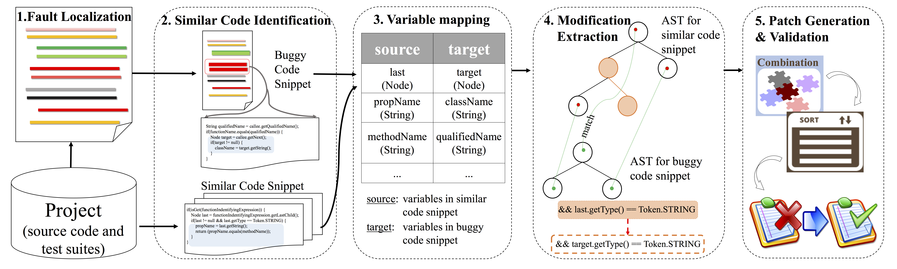
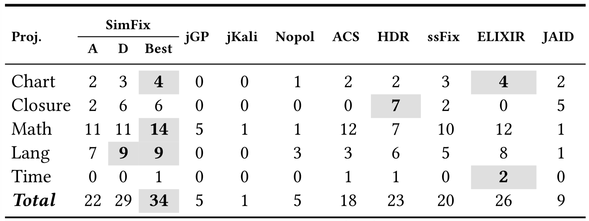
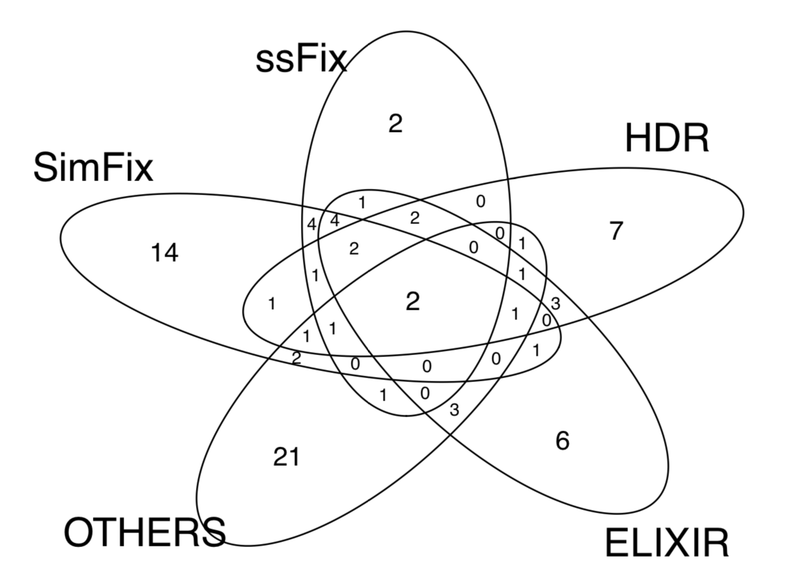

> ##### NOTE: SimFix depends on several [Defects4J](https://github.com/rjust/defects4j) commands. Therefore, if you want to conduct your experiment on other projects outside Defects4J, please adapt the project to the Defects4J framework. 

> ##### As an alternative, if you don't want to compile SimFix by youself, you also can download the replication package [[HERE](https://drive.google.com/open?id=144h3TkD9ziHZpW_xht0iELViLiskOIPP)] directly, which will save your time for setting up the running environment.

---

# SimFix

* [I. Introduction of SimFix](#user-content-i-introduction)
* [II. Environment setup](#user-content-ii-environment)
* [III. Run SimFix Step-by-Step](#user-content-iii-how-to-run)
* [IV. Evaluation Result](#user-content-iv-evaluation-result)
* [V. Structure of the project](#user-content-v-structure-of-the-project)

## I. Introduction

*SimFix* is an automatic program repair technique, which leverages exisiting patches from other projects and similar code snippets in the same project to generate patches. The following figure is the workflow of our approach.



#### Mining Stage

1. Mine repair patterns from existing open-source projects, after which we can obtain a set of frequent repair patterns. Those patterns can be reused for other repairing scenarios as well.

#### Repairing Stage

1. **Fault Localization** : obtain a ranking list of candidate faulty statements and extract corresponding code snippets.
2. **Donor Snippet Identification** : identify the similarity between faulty code snippet and each candidate similar code snippet by leveraging three similarity metrics, according to which we obtain a list of candidate similar snippets with decending order of similarity value.
3. **Variable Mapping** : establish the mapping relationship between variables in faulty and similar code snippets by leveraging similarity metrics and then obtain a mapping table, based on which the variables in the donor code snippet will be replaced with the corresponding variables.
4. **Modification Extraction and Intersection** : extract code modifications to faulty code snippet via AST (Abstract Syntax Tree) matching and differencing against the donor snippet, and then the frequent patterns from the mining stage will be used to take intersection with those modifications to further ruled out invalid ones.
5. **Patch Generation & Validation** : generate repair patches by applying extracted code modifications to the faulty code snippet with combining and ranking whose modifications, then using the test suite to validate the correctness of candidate patches until a correct patch found or timeout.

*If you want to use this project, please cite our technical paper published at [ISSTA'18](https://conf.researchr.org/home/issta-2018).*

```tex
@inproceedings{Simfix:2018,
    author   = {Jiang, Jiajun and Xiong, Yingfei and Zhang, Hongyu and
                Gao, Qing and Chen, Xiangqun},
    title    = {Shaping Program Repair Space with Existing Patches and Similar Code},
    series   = {ISSTA},
    year     = {2018},
    location = {Amsterdam, Netherlands},
    doi      = {10.1145/3213846.3213871},
} 
```


## II. Environment

* OS: Linux (Tested on Ubuntu 16.04.2 LTS)
* JDK: Oracle jdk1.7 (**important!**)
* Download and configure Defects4J (**branch  [fee5ddf020](https://github.com/rjust/defects4j/tree/fee5ddf020d0ce9c793655b74f0ab068153c03ef)**) running environment.
* Configure the following path.
  * DEFECTS4J_HOME="home_of_defects4j"


## III. How to run

*SimFix* was traditionally developed as an Eclipse Java project, you can simply import this project to your workspace and run it as a common Java program. The main class is **cofix.main.Main**, and for the running option please refer to the [Running Options](#user-content-step-2-running-options).

#### Before running

* `unzip` file `sbfl/data.zip` to `sbfl/data`  : used for fault localization

* using the command line provided by Defects4J to checkout a buggy version of benchmark for testing.

   Example: `defects4j checkout -p Chart -v 1b -w ${buggy_program_path}/chart/chart_1_buggy`

  **_NOTE_** : the path of the buggy version of benchmark have to be set as:

  `…/projectName/projectName_id_buggy`  => Example: `/home/user/chart/chart_1_buggy`

#### Step 1, Build The Project

Originally, *SimFix* was developed as an [Eclipse](http://www.eclipse.org/mars/) Java Project, you can simply **import** the project into your workspace and the class `cofix.main.Main` is the entry of the whole program.

#### Step 2, Running Options 

Our prototype of *SimFix* needs **three** input options for running.

* `--proj_home ` : the home of buggy program of benchmark. (`${buggy_program_path}` for the example)

* `--proj_name` : the project name of buggy program of benchmark. (`chart` for the example)

* `--bug_id` : the identifier of the buggy program. (`1` for the example)

  * The option of `--bugy_id` supports multiple formats:

    `single_id` : repair single bug, `e.g., 1`.

    `startId-endId` : repair a series of bugs with consecutive identifiers, `e.g., 1-3`.

    `single_id,single_id,single_id` : repair any bugs for the specific program, `e.g., 1,5,9`.

    `all` : repair all buggy versions of a specific project, `i.e., all`.

  ```powershell
  Usage: --proj_home=${proj_home} --proj_name=${proj_name} --bug_id=${bug_id}
  Example: --proj_home=/home/user --proj_name=chart --bug_id=1
  Another: --proj_home=/home/user --proj_name=chart --bug_id=1,4,8
  ```

**OPTION 1** : Run within eclipse (please use the old version: tested on **[Mars](https://www.eclipse.org/mars/)**, which depends on Java7).

* From the Main class:

   `Run As`→`Run Configurations…` →`Arguments` : set the above arguments as *Program Arguments*.

**OPTION 2** : run using command line.

* We also provide runnable jar file of *SimFix* in the home folder of the project `i.e., simfix.jar`.

  Set the home directory of the *SimFix* project as your correct path and then run as:

  `java -jar simfix.jar --proj_home=/home/user --proj_name=chart --bug_id=1`

#### Step 3, Result Analysis

After finishing the repair, there will be two additional folders: `log` and `patch`.

* `log` : debug output, including buggy statements already tried, patches and reference code snippet for correct patch generation.

* `patch` : a single source file repaired by *SimFix* that can pass the test suite. In the source file, you can find the patch, which is formatted as (example of Chart_1):

  ```java
  // start of generated patch
  int index=this.plot.getIndexOf(this);
  CategoryDataset dataset=this.plot.getDataset(index);
  if(dataset==null){
  return result;
  }
  // end of generated patch
  /* start of original code
          int index = this.plot.getIndexOf(this);
          CategoryDataset dataset = this.plot.getDataset(index);
          if (dataset != null) {
              return result;
          }
   end of original code*/
  ```

## IV. Evaluation Result

Totally, *SimFix* successfully repair 34 bugs among 357 bugs in Defects4J v1.0 benchmark with generating 22 plausible but incorrect patches. The following table and venn diagram are comparison with existing approaches. More details are presented in the sub-folder [final](./final) (latest).

|  |  |
| :--------------------------------------: | :--------------------------------------: |
| The comparison with existing approaches. |              Intersections.              |

## V. Structure of the project
```powershell
  |--- README.md   :  user guidance
  |--- bin         :  binary code
  |--- d4j-info    :  defects4j information
  |--- doc         :  document
  |--- final       :  evaluation result
  |--- lib         :  dependent libraries
  |--- sbfl        :  fault localization tool
  |--- src         :  source code
  |--- test        :  test suite
```

----


<u>__ALL__ suggestions are welcomed.</u>
