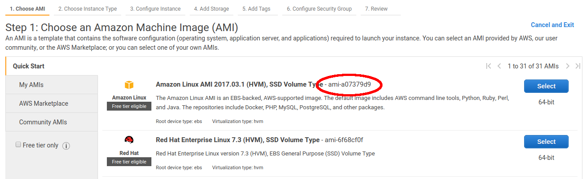

This directory contains several utilities to help run Killmap on AWS EC2 machines.

Usage
-----

### AWS Setup

(Before doing this, ensure that `FL_DATA_HOME` and `KILLMAP_HOME` are exported, as is done by `fault-localization-data/setup.sh`.)

1. Make a bucket on S3 to store your killmaps.
2. Make an IAM user who has full access to EC2 and who can read/write that S3 bucket.
3. Generate an access key for that user and download it.
4. Configure the AWS CLI to use that access key, using `aws configure`.
5. Make a security group on EC2, which allows incoming SSH connections. Save the `.pem` file (next to this Readme) as `fault-localization.pem`. (Scripts rely on this path. Don't worry, the filename does __not__ have to match AWS's name for the key.) Run `chmod 600 ./fault-localization.pem` or else AWS will refuse to use it.
6. Prepare an AWS image suitable for generating killmaps on.

    1. First, replace the `<TODO>`s in `setup-launch-spec.json` with the appropriate key/group names.

        * The ImageID should be the one Amazon suggests for 64-bit Linux when you click "Launch Instance" from the Console, e.g.

            

        * the KeyName should be the name you gave AWS for your SSH key;
        * the SecurityGroupIds should be a list with one element (`"sg-..."`).

    2. Run `./setup-instance.sh`. This will

        * start a new instance and install the necessary packages on it;
        * SSH into it and prompt you to `aws configure` it so it can put its results on S3;
        * create a machine image of that configured machine;
        * create the file `generation-launch-spec.json`, which later scripts rely on.

### Killmap Generation

Killmap generation is done by spinning up spot instances and telling them which faults to generate killmaps for. This is done by creating a "target file," which is a CSV with a format like

```csv
    Project,Bug,Timeout
    Lang,1,36h
    Lang,2,36h
    Closure,5,168h
```
(The first two columns specify a D4J fault, and the last column specifies a timeout, as you would pass to the `timeout` utility.)

Such a file is typically copied over to a fresh EC2 instance, which is then instructed via SSH to run Killmap and put the results on S3.

The only script you should need here is `launch-many-instances-generating-killmaps.sh`. It takes (a) a destination for the killmap files, e.g. `s3://my-killmap-bucket`, and (b) any number of target-files; and for each target-file, it starts a fresh EC2 instance, copies over the target-file, and tells the EC2 instance to generate the killmaps specified in the target-file, in order, putting the results in the specified S3 bucket. All other scripts are helpers for this task.
